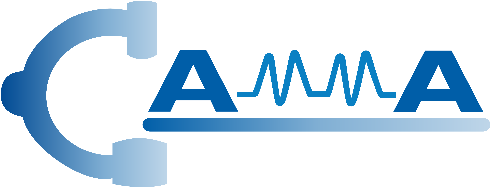

<div align="center">
<a href="http://camma.u-strasbg.fr/">

</a>
</div>

## **Self-Supervised Uncalibrated Multi-View Video Anonymization in the Operating Room**
Keqi Chen, [Vinkle Srivastav](https://vinkle.github.io/), Armine Vardazaryan, Cindy Rolland, Didier Mutter, Nicolas Padoy

[](https://arxiv.org/abs/2602.02850)

## Installation
1. Clone this repo, and we'll call the directory that you cloned as ${ROOT_DIR}.
2. Install dependencies. 
```shell
> conda create -n anonymization python=3.10
> conda activate anonymization
(anonymization)> conda install pytorch==2.5.1 torchvision==0.20.1 pytorch-cuda=11.8 -c pytorch -c nvidia
(anonymization)> pip install -r requirements.txt
```
3. Install Torchreid following [deep-person-reid](https://github.com/KaiyangZhou/deep-person-reid).
4. Install Iter-Deformable-DETR following [p-d-detr](https://github.com/zyayoung/Iter-Deformable-DETR).
5. Install MMPOSE following [mmpose](https://github.com/open-mmlab/mmpose).
6. Install DEIM following [deim](https://github.com/Intellindust-AI-Lab/DEIM).

## Data preparation

### 4D-OR dataset
1. Download the [4D-OR dataset](https://github.com/egeozsoy/4D-OR) and place it in `./data/` as:
```
${ROOT_DIR}
|-- data
    |-- 4D-OR
        |-- export_holistic_take1_processed
            |-- colorimage
```
2. Run command:
```bash
python ./data/generate_img_dicts.py
```

## Training
### 4D-OR dataset
```
bash scripts/train_4dor.sh ../data/4D-OR/export_holistic_take1_processed ../data/4D-OR/detections/export_holistic_take1_processed.imdb export_holistic_take1_processed 0
```

## Inference
### 4D-OR dataset
```
bash scripts/inference_4dor.sh ../data/4D-OR/export_holistic_take1_processed ../data/4D-OR export_holistic_take1_processed_iter1 0
```

### References
The project uses [deep-person-reid](https://github.com/KaiyangZhou/deep-person-reid), [p-d-detr](https://github.com/zyayoung/Iter-Deformable-DETR), [mmpose](https://github.com/open-mmlab/mmpose), and [deim](https://github.com/Intellindust-AI-Lab/DEIM). We thank the authors for releasing their codes. 

## License
This code and models are available for non-commercial scientific research purposes as defined in the [CC BY-NC-SA 4.0](https://creativecommons.org/licenses/by-nc-sa/4.0/). By downloading and using this code you agree to the terms in the [LICENSE](LICENSE). Third-party codes are subject to their respective licenses.
