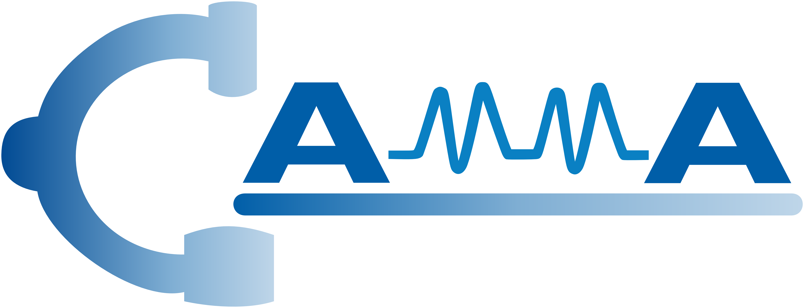

<div align="center">
<a href="http://camma.u-strasbg.fr/">

</a>
</div>

## **Self-Supervised Uncalibrated Multi-View Video Anonymization in the Operating Room**
Keqi Chen, [Vinkle Srivastav](https://vinkle.github.io/), Armine Vardazaryan, Cindy Rolland, Didier Mutter, Nicolas Padoy

[](https://arxiv.org/abs/2602.02850)

## Introduction

<div style="text-align: justify"> 
Privacy preservation is a prerequisite for using video data in Operating Room (OR) research. Effective anonymization relies on the exhaustive localization of every individual; even a single missed detection necessitates extensive manual correction. However, existing approaches face two critical scalability bottlenecks: (1) they usually require manual annotations at each new clinical site for high accuracy; (2) multi-view approaches typically require camera calibration whenever cameras are repositioned. To address these problems, we propose a self-supervised multi-view video anonymization framework based on whole-body person detection and pose estimation, without manual annotations or camera calibration. Our core strategy is to conduct self-supervised domain adaptation of a single-view detector by "retrieving" false negatives using temporal and multi-view context. We first apply an off-the-shelf whole-body detector with a low-score threshold to gather candidate detections. Then, we retrieve low-score false negatives that are consistent with high-score detections via tracking and self-supervised, uncalibrated multi-view association. The recovered detections serve as pseudo-labels to iteratively fine-tune the detector. Finally, we apply whole-body pose estimation on each detected person, and fine-tune the pose model using its own high-score predictions. Experiments on the simulated 4D-OR dataset and our real-surgery dataset achieve 99\% and 97\% recall, respectively. We further train a real-time whole-body detector using the generated pseudo-labels, achieving comparable performance and highlighting our method’s practical applicability.
</div>

#### In this repo we provide:
- Training, inference, and testing code for video anonymization in the 4D-OR dataset. 
- Trained models on the 4D-OR dataset. 

## Installation
1. Clone this repo, and we'll call the directory that you cloned as ${ROOT_DIR}.
2. Install dependencies. 
```shell
> conda create -n anonymization python=3.10
> conda activate anonymization
(anonymization)> conda install pytorch==2.5.1 torchvision==0.20.1 pytorch-cuda=11.8 -c pytorch -c nvidia
(anonymization)> pip install -r requirements.txt
```
3. Install Torchreid following [deep-person-reid](https://github.com/KaiyangZhou/deep-person-reid).
4. Install Iter-Deformable-DETR following [p-d-detr](https://github.com/zyayoung/Iter-Deformable-DETR).
5. Install MMPOSE following [mmpose](https://github.com/open-mmlab/mmpose).
6. Install DEIM following [deim](https://github.com/Intellindust-AI-Lab/DEIM).

## Data preparation

### 4D-OR dataset
1. Download the [4D-OR dataset](https://github.com/egeozsoy/4D-OR) and place it in `./data/` as:
```
${ROOT_DIR}
|-- data
    |-- 4D-OR
        |-- export_holistic_take1_processed
            |-- colorimage
```
2. Run command:
```bash
python ./data/generate_img_dicts.py
```

### Trained models
Download the trained DEIM model as follows for direct inference.

```shell
> wget https://s3.unistra.fr/camma_public/github/OR_anonymization/deim_hgnetv2_x_4dor_sam3.pth
```

## Training
### 4D-OR dataset
```
bash scripts/train_4dor.sh ../data/4D-OR/export_holistic_take1_processed ../data/4D-OR/detections/export_holistic_take1_processed_sam3.lmdb export_holistic_take1_processed 0
```

## Inference
### 4D-OR dataset
```
bash scripts/inference_4dor.sh ../data/4D-OR/export_holistic_take1_processed ../data/4D-OR export_holistic_take1_processed_sam3_deim 0
```

## Testing
### 4D-OR dataset
```
bash scripts/inference_4dor.sh ../data/4D-OR/export_holistic_take2_processed ../data/4D-OR export_holistic_take2_processed_sam3_deim 0
bash scripts/inference_4dor.sh ../data/4D-OR/export_holistic_take6_processed ../data/4D-OR export_holistic_take6_processed_sam3_deim 0
bash scripts/eval_4dor.sh sam3_deim_evaluation --pred_path ../data/4D-OR/face/export_holistic_take2_processed_sam3_deim_face.lmdb ../data/4D-OR/face/export_holistic_take6_processed_sam3_deim_face.lmdb --anno_path annotations/export_holistic_take2_processed_full_body_hard_case.json annotations/export_holistic_take6_processed_full_body_hard_case.json --img_dicts ../data/4D-OR/export_holistic_take2_processed/img_dicts.pkl ../data/4D-OR/export_holistic_take6_processed/img_dicts.pkl
```

## Citation
If you use our code or models in your research, please cite with:
```bibtex
@article{chen2026self,
  title={Self-Supervised Uncalibrated Multi-View Video Anonymization in the Operating Room},
  author={Chen, Keqi and Srivastav, Vinkle and Vardazaryan, Armine and Rolland, Cindy and Mutter, Didier and Padoy, Nicolas},
  journal={arXiv preprint arXiv:2602.02850},
  year={2026}
}
```

### References
The project uses [deep-person-reid](https://github.com/KaiyangZhou/deep-person-reid), [p-d-detr](https://github.com/zyayoung/Iter-Deformable-DETR), [mmpose](https://github.com/open-mmlab/mmpose), and [deim](https://github.com/Intellindust-AI-Lab/DEIM). We thank the authors for releasing their codes. 

## License
This code and models are available for non-commercial scientific research purposes as defined in the [CC BY-NC-SA 4.0](https://creativecommons.org/licenses/by-nc-sa/4.0/). By downloading and using this code you agree to the terms in the [LICENSE](LICENSE). Third-party codes are subject to their respective licenses.
